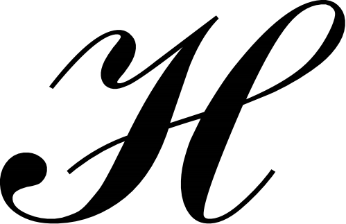

ezttf
=====

This is work in progress ttf rasterization library written in rust. So far it can do some
basic rasterization but it still lacks a lot of functionality. Here's an example of its output when
rasterizing U+210B from FreeSerif:

